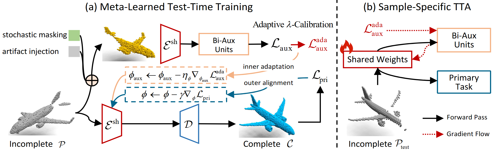

# PointMAC: Meta-learned Adaptation for Robust Test-time Point Cloud Completion (NeurIPS 2025)


> **Linlian Jiang**, [Rui Ma](https://ruim-jlu.github.io/), [Li Gu](https://scholar.google.ca/citations?user=crdHC0sAAAAJ&hl=en), [Ziqiang Wang](https://scholar.google.com/citations?hl=zh-CN&user=1CYvfKMAAAAJ&view_op=list_works&sortby=pubdate), [Xinxin Zuo*](https://sites.google.com/site/xinxinzuohome/home), [Yang Wang*](https://users.encs.concordia.ca/~wayang/)

> Concordia University, Jilin University

<a href="https://arxiv.org/abs/2510.10365"></a>
<a href="https://linlianjiang.github.io/pointmac/"></a>

### TODO List
- [x] We have released the code (Dec. 2025)

### Overview
TTA with meta-auxiliary learning provides a general framework: the auxiliary task is **NOT** restricted to **enumerating all possible failure modes**. Instead, it can be tailored to different objectives as needed, fundamentally **overcoming the limitations of static, pre-defined strategies**. This enables dynamic, per-sample adaptation to previously unseen patterns, allowing our model to robustly recover fine details where traditional static training or enumerative augmentation would fail.
<div align="center">
  </img>
</div>

### Datasets

We use the [PCN](https://www.shapenet.org/), [ShapeNet-34/21](https://github.com/yuxumin/PoinTr), [MVP](https://mvp-dataset.github.io/), and [KITTI](https://www.cvlibs.net/datasets/kitti/) datasets in our experiments, which are available below:

- [PCN](https://drive.google.com/drive/folders/1P_W1tz5Q4ZLapUifuOE4rFAZp6L1XTJz)
- [ShapeNet-34/21](https://github.com/yuxumin/PoinTr/blob/master/DATASET.md)
- [MVP](https://mvp-dataset.github.io/)
- [KITTI](https://www.cvlibs.net/datasets/kitti/)
  
### Preparation
**Tips**: If you have a configured virtual environment for [SnowflakeNet](https://github.com/AllenXiangX/SnowflakeNet) (or [PoinTr](https://github.com/yuxumin/PoinTr)), you can reuse it instead of installing a new one.

1. Clone pointmac.
```bash
git clone --recursive https://github.com/linlianjiang/pointmac.git
cd pointmac
```
2. Create the environment, here we show an example using conda
```bash
conda create -n pointm python=3.8
conda activate pointm
pip install -r requirements.txt
```

### Training
(1) Pretraining
```bash
bash run.sh
```

### Evaluation
To evaluate a pre-trained model, set the model_path in the configuration file before running:

```
python test.py --configs <config>
```


### Citing
If you use our **PointMAC** code in your research, please consider citing:
```BibTeX
@article{jiang2025pointmac,
  title={PointMAC: Meta-Learned Adaptation for Robust Test-Time Point Cloud Completion},
  author={Jiang, Linlian and Ma, Rui and Gu, Li and Wang, Ziqiang and Zuo, Xinxin and Wang, Yang},
  journal={arXiv preprint arXiv:2510.10365},
  year={2025}
}
```
